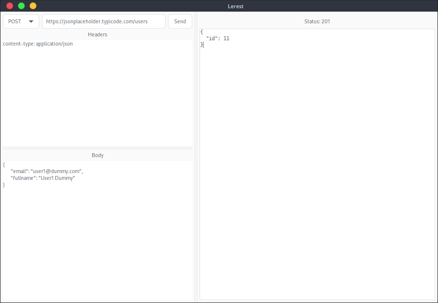

# Lerest
Rest client built on top GTK-3.

# Table of Contents
* [Background](#background)

# Background
Most of the REST clients like [Postman](https://www.postman.com) and [Insomnia](https://insomnia.rest/) run on top of Chromium
which consumes a lot of the computer's resources. In the other side, there are other powerful tool but command line based that
are not comfortable for those who are not familiar, such as [cURL](https://curl.se).

Then, we need a tool that is convenient and consumes computer resources appropriately. Here comes [Lerest](https://github.com/hadihammurabi/lerest),
a GUI based REST client on top of GTK 3 which is fast, lightweight and easy to use.
